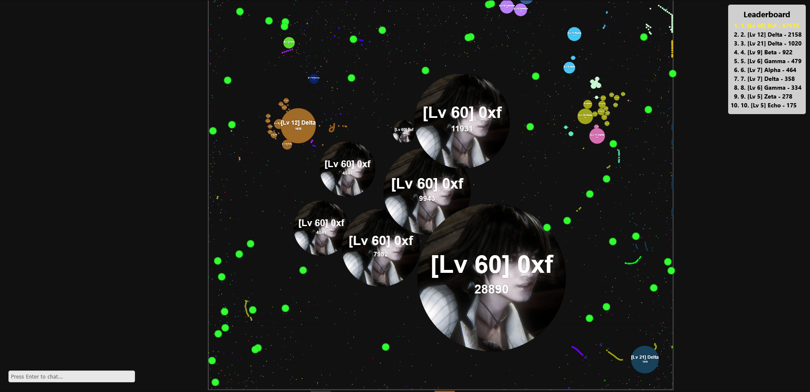

# Agar.io Clone



A custom, multiplayer Agar.io clone built with Node.js, Express, Socket.IO, and HTML5 Canvas.

## Features

- **Real-time Multiplayer Engine**: Stateful WebSockets using Socket.IO running at 60 FPS.
- **Two Game Modes**:
  - **FFA**: Classic Free-For-All with standard physics and merge wait times.
  - **Fast Merge**: Fast-paced game mode with instant cell merging, accelerated mass growth, and 3x virus spawns.
- **Advanced Bot AI**:
  - Intelligent bots dynamically populate the server based on player counts.
  - Bots use Threat Analysis, Virus Sniping, and Self-Feeding to survive.
  - In Fast Merge mode, bots utilize the fast merge timers and spawn massive!
- **Leveling System**: Persistent XP and leveling system tied to maximum mass.
- **Custom Client-side UI**:
  - Zoom levels dynamically react to player size to guarantee massive FOVs.
  - Grid step rendering dynamically optimizes rendering loops based on zoom.
  - Mobile touch support (Joysticks and Action buttons).

## Installation

1. Make sure you have [Node.js](https://nodejs.org/) installed.
2. Clone this repository or download the source code.
3. Open a terminal in the project directory.
4. Install the dependencies:
   ```bash
   npm install
   ```

## Running the Game

Run the server with the following command:

```bash
npm start
```
By default, the server will listen on port `3000`. 
Open your web browser and go to: `http://localhost:3000`

## Controls
- **Mouse**: Move your cells.
- **Space**: Split your cells to attack or run away.
- **W**: Eject mass to feed viruses, teammates, or bait enemies.

## Optimizations
This game engine uses a custom server-side `SpatialHash` implementation to quickly search a 6000x6000 unit area and check for 2D circular boundary collisions (e.g. eating food, viruses, cells) without $O(N^2)$ checks! Both the spatial hashing grid sizes and HTML Canvas grid renderers have been aggressively optimized to maintain 60 FPS even when players reach colossal sizes.
